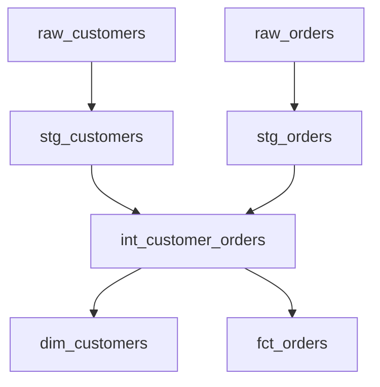

# How the CI Workflow Works - Detailed Explanation

## 🏗 **PostgreSQL Service Container Setup**

When a PR is created, GitHub Actions automatically:

### **1. Infrastructure Setup**
```yaml
services:
  postgres:
    image: postgres:14
    env:
      POSTGRES_PASSWORD: postgres
      POSTGRES_DB: ecommerce
    ports:
      - 5432:5432
```

**What this creates:**
- ✅ Fresh PostgreSQL 14 container
- ✅ Empty `ecommerce` database  
- ✅ Available at `localhost:5432` inside the GitHub runner
- ✅ Username: `postgres`, Password: `postgres`

### **2. Initial State**
```
ecommerce (database)
├── public (schema) - EMPTY
└── information_schema, pg_catalog (system schemas)
```

**No tables, no data yet!**

## 📊 **Step-by-Step Data Flow**

### **Step 1: dbt seed - Load CSV Data**

**Command:** `dbt seed --target dev`

**What happens:**
```sql
-- Creates tables from your CSV files
CREATE TABLE public.raw_customers (
    customer_id INTEGER,
    first_name TEXT,
    last_name TEXT,
    email TEXT,
    registration_date TEXT
);

-- Inserts data from seeds/raw_customers.csv
INSERT INTO public.raw_customers VALUES
(1, 'John', 'Doe', 'john.doe@email.com', '2023-01-15'),
(2, 'Jane', 'Smith', 'jane.smith@email.com', '2023-02-20'),
(3, 'Bob', 'Johnson', 'bob.johnson@email.com', '2023-03-10'),
(4, 'Alice', 'Brown', 'alice.brown@email.com', '2023-04-05'),
(5, 'Charlie', 'Davis', 'charlie.davis@email.com', '2023-05-12');

-- Same for raw_orders table
CREATE TABLE public.raw_orders (...);
INSERT INTO public.raw_orders VALUES (...);
```

**Database state after seeding:**
```
ecommerce (database)
├── public (schema)
│   ├── raw_customers (5 rows) ✅
│   └── raw_orders (7 rows) ✅
```

### **Step 2: dbt run - Build Models**

**Command:** `dbt run --target dev`

**Schema Creation:**
- PR: Creates `pr_123_analytics` schema
- Main: Creates `main_analytics` schema

**Model Execution Order:**


**Actual SQL Execution:**

1. **Staging Models (Views):**
```sql
-- stg_customers.sql creates:
CREATE VIEW pr_123_analytics.stg_customers AS (
    SELECT
        customer_id,
        first_name,
        last_name,
        email,
        registration_date::date as registration_date,
        concat(first_name, ' ', last_name) as full_name,
        lower(email) as email_lower
    FROM public.raw_customers  -- References seed data!
    WHERE email is not null
);

-- stg_orders.sql creates similar view
```

2. **Intermediate Models (Views):**
```sql
-- int_customer_orders.sql creates:
CREATE VIEW pr_123_analytics.int_customer_orders AS (
    SELECT
        c.customer_id,
        c.full_name,
        c.email_lower,
        c.registration_date,
        o.order_id,
        o.order_date,
        o.status as order_status,
        o.total_amount,
        o.is_completed
    FROM pr_123_analytics.stg_customers c
    LEFT JOIN pr_123_analytics.stg_orders o 
        ON c.customer_id = o.customer_id
);
```

3. **Mart Models (Tables):**
```sql
-- dim_customers.sql creates:
CREATE TABLE pr_123_analytics.dim_customers AS (
    SELECT
        customer_id,
        full_name,
        email_lower as email,
        registration_date,
        count(case when is_completed = 1 then 1 end) as completed_orders,
        count(order_id) as total_orders,
        coalesce(sum(case when is_completed = 1 then total_amount end), 0) as total_revenue,
        -- ... more aggregations
    FROM pr_123_analytics.int_customer_orders
    GROUP BY customer_id, full_name, email_lower, registration_date
);
```

**Database state after dbt run:**
```
ecommerce (database)
├── public (schema)
│   ├── raw_customers (5 rows)
│   └── raw_orders (7 rows)
└── pr_123_analytics (schema)
    ├── stg_customers (view) → 5 rows
    ├── stg_orders (view) → 7 rows  
    ├── int_customer_orders (view) → 7 rows (with JOINs)
    ├── dim_customers (table) → 5 rows (aggregated)
    └── fct_orders (table) → 7 rows (enriched)
```

### **Step 3: dbt test - Validate Data**

**Command:** `dbt test --target dev`

**Tests Execute:**
```sql
-- Test: stg_customers.customer_id is unique
SELECT customer_id, count(*)
FROM pr_123_analytics.stg_customers
GROUP BY customer_id
HAVING count(*) > 1;
-- Should return 0 rows ✅

-- Test: dim_customers.total_revenue >= 0  
SELECT customer_id, total_revenue
FROM pr_123_analytics.dim_customers
WHERE total_revenue < 0;
-- Should return 0 rows ✅

-- Test: Foreign key relationship
SELECT o.customer_id
FROM pr_123_analytics.stg_orders o
LEFT JOIN pr_123_analytics.stg_customers c
    ON o.customer_id = c.customer_id
WHERE c.customer_id IS NULL;
-- Should return 0 rows ✅
```

## 🔄 **Complete CI Flow Visualization**

```
🚀 PR Created → GitHub Actions Triggered

┌─────────────────────────┐
│   GitHub Actions       │
│                         │
│  ┌─────────────────┐   │
│  │ PostgreSQL      │   │
│  │ Container       │   │
│  │                 │   │
│  │ ecommerce DB    │   │
│  │ (empty)         │   │
│  └─────────────────┘   │
└─────────────────────────┘

⬇️ dbt seed

┌─────────────────────────┐
│   PostgreSQL Container  │
│                         │
│  ecommerce              │
│  ├── public             │
│  │   ├── raw_customers  │ ← CSV data loaded
│  │   └── raw_orders     │ ← CSV data loaded
│  └── (no other schemas) │
└─────────────────────────┘

⬇️ dbt run

┌─────────────────────────┐
│   PostgreSQL Container  │
│                         │
│  ecommerce              │
│  ├── public             │
│  │   ├── raw_customers  │
│  │   └── raw_orders     │
│  └── pr_123_analytics   │ ← NEW SCHEMA!
│      ├── stg_customers  │ ← Models created
│      ├── stg_orders     │
│      ├── int_customer_orders │
│      ├── dim_customers  │
│      └── fct_orders     │
└─────────────────────────┘

⬇️ dbt test

┌─────────────────────────┐
│   Tests Results         │
│                         │
│  ✅ Uniqueness tests    │
│  ✅ Not null tests      │
│  ✅ Relationship tests  │
│  ✅ Custom tests        │
│                         │
│  🎉 All tests passed!   │
└─────────────────────────┘

⬇️ CI Complete

📝 GitHub Comment Posted:
   ✅ dbt CI Pipeline Passed
   - SQL linting: ✅ Passed  
   - dbt tests: ✅ All tests passed
   - Schema: pr_123_analytics
```

## 🎯 **Key Points**

### **Data Source:**
- ✅ **Seeds (CSV files)** provide the test data
- ✅ **No external database** connection needed
- ✅ **Fresh data** every CI run (repeatable)

### **Isolation:**
- ✅ **Each PR** gets its own schema (`pr_123_analytics`)
- ✅ **No conflicts** between different PRs
- ✅ **Clean environment** every time

### **Speed:**
- ✅ **Small datasets** (5 customers, 7 orders)
- ✅ **In-memory container** (fast)
- ✅ **Parallel execution** where possible

### **Real Testing:**
- ✅ **Actual PostgreSQL** (not mocked)
- ✅ **Real SQL execution** 
- ✅ **Same dbt commands** as production
- ✅ **Actual data transformations**

## ❓ **FAQ**

**Q: Where does the data come from?**
A: Your CSV files in the `seeds/` folder become database tables

**Q: Is this real data?**  
A: It's real PostgreSQL execution with test data (from your CSV files)

**Q: How is it different from production?**
A: Same dbt logic, different data source (seeds vs production tables)

**Q: What if I don't have seed files?**
A: You need seed files OR modify the workflow to connect to external data

**Q: Can I use my localhost data?**
A: Not directly in GitHub Actions. Use seeds for CI, localhost for local testing

This approach gives you **real dbt testing** with **isolated, repeatable environments**!