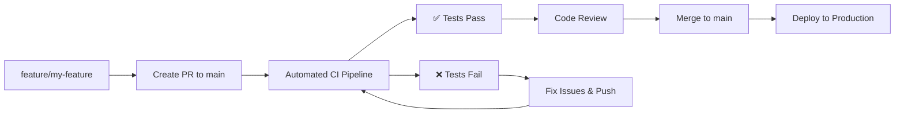
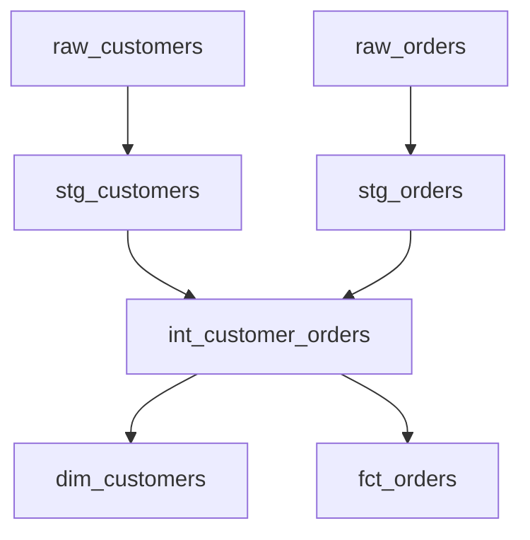

# E-commerce Analytics dbt Project

This is a sample dbt project demonstrating an improved CI/CD workflow for collaborative dbt development.

## 🚀 New Workflow: Feature-to-Main

### Benefits Over Previous dev→stg→main Workflow:
- ✅ **No Blocking**: Developers work independently on feature branches
- ✅ **Automated Testing**: No more manual screenshot requirements
- ✅ **Faster Feedback**: Immediate CI results on PRs
- ✅ **Isolated Testing**: Each PR gets its own schema
- ✅ **Parallel Development**: Multiple features can be developed simultaneously

## 📋 Workflow Overview



## 🛠 Developer Workflow

### 1. Create Feature Branch
```bash
git checkout main
git pull origin main
git checkout -b feature/add-customer-metrics
```

### 2. Develop Your Changes
- Add/modify models in `models/`
- Add tests in `tests/` or `schema.yml`
- Update documentation as needed

### 3. Test Locally (Optional)
```bash
dbt deps
dbt run --select +my_new_model
dbt test --select +my_new_model
```

### 4. Push and Create PR
```bash
git add .
git commit -m "Add customer lifetime value metrics"
git push origin feature/add-customer-metrics
```

### 5. Automated CI Pipeline Runs
The CI pipeline will automatically:
- **Lint** SQL code with SQLFluff
- **Create** isolated schema: `pr_123_analytics`
- **Build** only modified models and dependencies
- **Run** all dbt tests
- **Comment** on PR with results
- **Cleanup** schema when PR is closed

### 6. Review and Merge
- Address any CI failures
- Get code review approval
- PR automatically merges when all checks pass

## 🔧 CI Pipeline Features

### Automated Quality Gates
- **SQL Linting**: Ensures consistent code style
- **Model Building**: Validates SQL syntax and dependencies  
- **dbt Tests**: Runs data quality tests
- **Schema Isolation**: Each PR gets unique schema
- **Automatic Cleanup**: Removes PR schemas after merge/close

### Smart Building
- **PR Builds**: Only modified models + downstream dependencies
- **Main Builds**: Full refresh of all models
- **State Comparison**: Uses dbt state to detect changes

### Notifications
- **Success**: ✅ Green check with schema info
- **Failure**: ❌ Clear error messages with logs
- **PR Comments**: Automated status updates

## 📁 Project Structure

```
├── models/
│   ├── staging/          # Raw data cleaning & standardization
│   │   ├── stg_customers.sql
│   │   ├── stg_orders.sql
│   │   └── schema.yml    # Tests & documentation
│   ├── intermediate/     # Business logic transformations
│   │   └── int_customer_orders.sql
│   └── marts/           # Final analytical models
│       ├── dim_customers.sql
│       ├── fct_orders.sql
│       └── schema.yml
├── tests/               # Custom data tests
├── seeds/              # Reference data
├── macros/             # Reusable SQL functions
├── .github/
│   └── workflows/      # CI/CD pipelines
├── .pre-commit-config.yaml
├── .sqlfluff           # SQL linting rules
└── dbt_project.yml
```

## 🎯 Model Dependencies



## 🧪 Testing Strategy

### Built-in dbt Tests
- **Uniqueness**: Primary keys
- **Not Null**: Required fields
- **Relationships**: Foreign key constraints
- **Accepted Values**: Categorical fields

### Custom Tests
- **Data Quality**: Revenue validation
- **Business Logic**: Metric calculations
- **Performance**: Query optimization

### Test Coverage
- **Staging Models**: Data validation & cleaning
- **Mart Models**: Business logic & metrics
- **Seeds**: Reference data integrity

## 🚀 Setup Instructions

### 1. Repository Setup
```bash
git clone <your-repo>
cd dbt_ci_test
pip install -r requirements.txt
```

### 2. Database Connection
Set environment variables:
```bash
export DBT_HOST=your-db-host
export DBT_USER=your-db-user
export DBT_PASSWORD=your-db-password
export DBT_DATABASE=your-database
```

### 3. GitHub Configuration
Follow: `.github/branch_protection_setup.md`

### 4. Pre-commit Hooks (Optional)
```bash
pip install pre-commit
pre-commit install
```

### 5. First Run
```bash
dbt deps
dbt seed
dbt run
dbt test
```

## 📊 Environment Strategy

### Development
- **Local**: Personal development environment
- **Schema**: `pr_<number>_analytics` for PRs
- **Data**: Sample/test datasets

### Production
- **Deployment**: Automated on main branch merges
- **Schema**: `analytics` 
- **Data**: Full production datasets
- **Monitoring**: Automated alerts and logging

## 🔍 Troubleshooting

### Common Issues

#### CI Pipeline Failures
1. **SQL Lint Errors**: Check SQLFluff output
2. **dbt Test Failures**: Review test results in logs
3. **Connection Issues**: Verify secrets configuration

#### Local Development
1. **Profile Issues**: Check `profiles.yml` setup
2. **Package Errors**: Run `dbt deps`
3. **Permission Issues**: Verify database access

### Getting Help
- Check GitHub Actions logs for detailed error messages
- Review dbt documentation: [docs.getdbt.com](https://docs.getdbt.com)
- Ask team members for code review feedback

## 📈 Migration from Old Workflow

### Phase 1: Preparation (Week 1)
- Set up GitHub Actions pipelines
- Configure branch protection rules
- Train team on new workflow

### Phase 2: Parallel Testing (Week 2)
- Run both old and new workflows
- Compare results and fix issues
- Update team documentation

### Phase 3: Full Migration (Week 3)
- Switch to feature-to-main workflow
- Remove dev/stg bottleneck branches
- Monitor and optimize performance

### Phase 4: Optimization (Week 4)
- Fine-tune CI performance
- Add advanced monitoring
- Gather team feedback and iterate